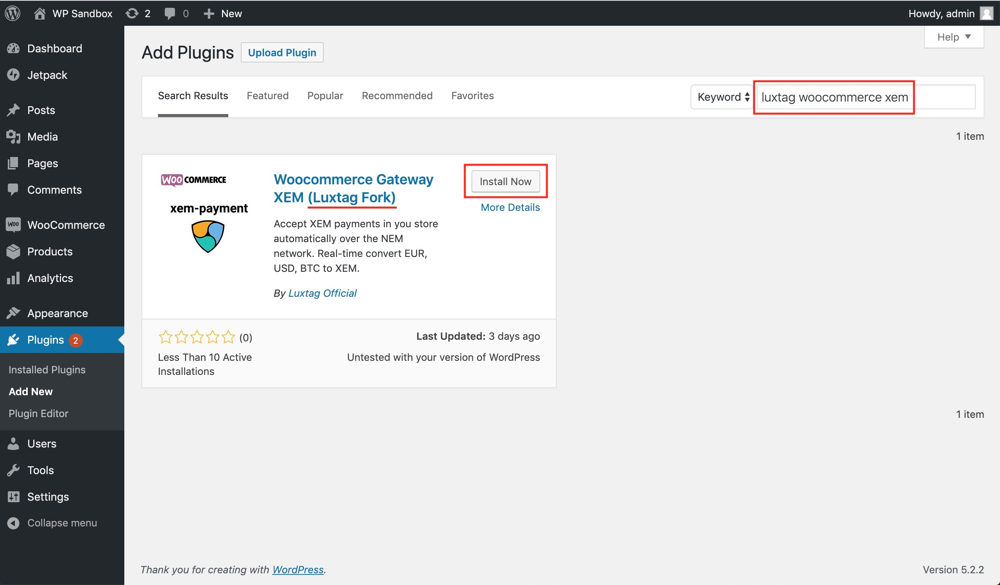
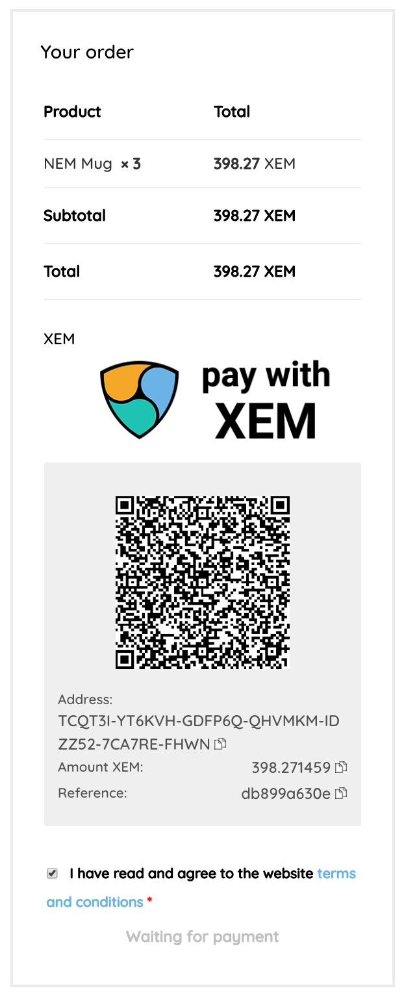

## Woocommerce Gateway XEM

This Wordpress Woocommerce plugin is forked from https://github.com/RobertoSnap/woocommerce-gateway-xem. 

The original repo seems to be no longer maintained and this fork is an effort to ensure that the plugin will still be usable for current wordpress.

### Installation

To install this plugin in your Wordpress, search for `luxtag woocommerce xem` and click "Install Now".

Alternatively, you can download the plugin and upload it to your Wordpress. Plugin URL:
https://wordpress.org/plugins/woo-xem-gateway-luxtag-fork/

### Demo

This is how the plugin would look like when activated. The styling might look different in your Wordpress (depending on your Wordpress theme, css, etc).

### Donation

You can send some XEM to this address if you'd like to donate for this plugin's maintenance. NEM address:

`NDESOVOBHA4L2U5WNRTZAYQADO76K7532RXGMERH`